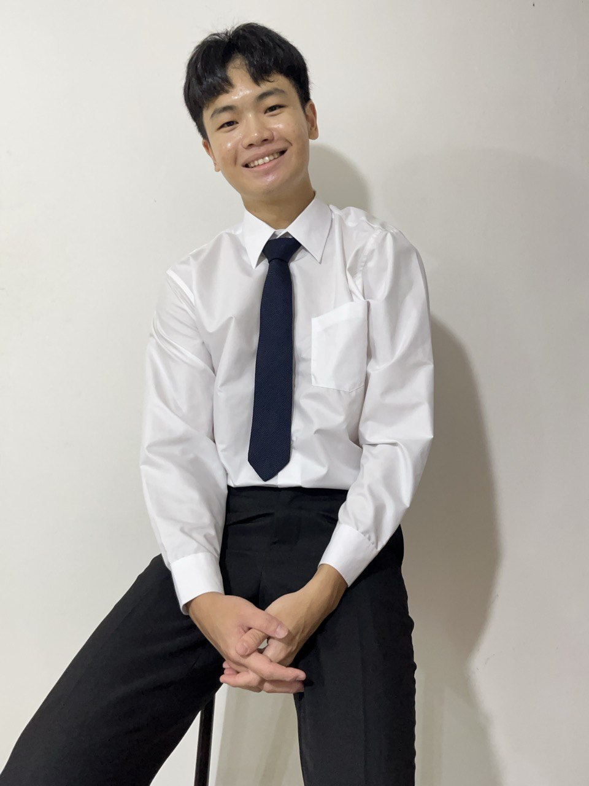

# About Us

We are a team based in the [School of Computing, National University of Singapore](http://www.comp.nus.edu.sg).

You can reach us at the email `seer[at]comp.nus.edu.sg`

## Project team

### Gabriel Phua

[[github](https://github.com/gab4i3l)]

### Victoria Chew

[[homepage](http://www.comp.nus.edu.sg/~damithch)]
[[github](https://github.com/victoria-chew)]
[[portfolio](team/johndoe.md)]

* Role: Project Advisor

### Eunwoo Jung

[[github](http://github.com/Qolivia)]

* Role: Team Lead
* Responsibilities: UI

### Johnny Doe

[[github](http://github.com/johndoe)] [[portfolio](team/johndoe.md)]

* Role: Developer
* Responsibilities: Data

### Daren Tan

[[github](http://github.com/darentanrw)]

* Role: Developer
* Responsibilities:

### Qing Rong

[[github](https://github.com/QR-Phua)]

* Role: Developer
* Responsibilities: Software Engineering
