# Tuto User Guide

**Tuto** is a desktop app that helps **parents manage a list of freelance tutors** for their children. It is optimised for users who prefer typing commands over clicking through menus, while still providing a clean visual interface to view tutor information at a glance.

<box type="info" seamless>

**Who is this guide for?**
This guide is written for parents who are comfortable using a keyboard and want to manage tutor contacts efficiently. No prior technical experience is required — if you can open a terminal and type commands, you are ready to use Tuto.

</box>

---

## Table of Contents

- [Tuto User Guide](#tuto-user-guide)
  - [Table of Contents](#table-of-contents)
  - [Quick Start](#quick-start)
    - [Step 1 — Install Java](#step-1--install-java)
    - [Step 2 — Download Tuto](#step-2--download-tuto)
    - [Step 3 — Launch Tuto](#step-3--launch-tuto)
    - [Step 4 — Try Your First Commands](#step-4--try-your-first-commands)
  - [Understanding the Interface](#understanding-the-interface)
  - [Command Basics](#command-basics)
    - [Notes on Command Format](#notes-on-command-format)
    - [Understanding List Indices](#understanding-list-indices)
    - [Duplicate Tutors are Not Allowed](#duplicate-tutors-are-not-allowed)
  - [Commands](#commands)
    - [Viewing Help : `help`](#viewing-help--help)
    - [Adding a Tutor : `add`](#adding-a-tutor--add)
      - [Parameters](#parameters)
      - [Constraints](#constraints)
      - [Examples](#examples)
    - [Editing a Tutor Profile : `edit`](#editing-a-tutor-profile--edit)
      - [Parameters](#parameters-1)
      - [Constraints](#constraints-1)
      - [Examples](#examples-1)
      - [Invalid Usage](#invalid-usage)
    - [Deleting a Tutor : `delete`](#deleting-a-tutor--delete)
      - [Parameters](#parameters-2)
      - [Examples](#examples-2)
    - [Finding Tutors : `find`](#finding-tutors--find)
      - [Prefixes](#prefixes)
      - [Search Modes](#search-modes)
      - [How Matching Works](#how-matching-works)
      - [Examples](#examples-3)
      - [Invalid Usage](#invalid-usage-1)
    - [Sorting the Tutor List : `sort`](#sorting-the-tutor-list--sort)
      - [Parameters](#parameters-3)
      - [Examples](#examples-4)
      - [Invalid Usage](#invalid-usage-2)
    - [Listing All Tutors : `list`](#listing-all-tutors--list)
    - [Clearing All Entries : `clear`](#clearing-all-entries--clear)
    - [Exiting the Program : `exit`](#exiting-the-program--exit)
  - [Data Management](#data-management)
    - [Saving Your Data](#saving-your-data)
    - [Editing the Data File Directly](#editing-the-data-file-directly)
  - [FAQ](#faq)
  - [Known Issues](#known-issues)
  - [Command Summary](#command-summary)

---

## Quick Start

Follow these steps to get Tuto running on your computer in under 5 minutes.

### Step 1 — Install Java

Tuto requires **Java 17 or above**.

- **Windows / Linux:** Download Java 17 from [Adoptium](https://adoptium.net/).
- **Mac:** Follow the exact installation steps [here](https://se-education.org/guides/tutorials/javaInstallationMac.html), as the standard Mac JDK may not be compatible.

To verify your Java version, open a terminal and run:

```
java -version
```

You should see `17` or higher in the output.

### Step 2 — Download Tuto

Download the latest `tuto.jar` file from the [Tuto releases page](https://github.com/AY2526S2-CS2103T-T15-3/tp/releases).

Move the file into a dedicated folder (e.g. `~/tuto/`). This folder will store your data going forward.

### Step 3 — Launch Tuto

1. Open a terminal (Command Prompt on Windows, Terminal on Mac/Linux).
2. Navigate to the folder containing `tuto.jar`:
    ```
    cd ~/tuto
    ```
3. Run the application:
    ```
    java -jar tuto.jar
    ```

A window similar to the one below should appear within a few seconds.

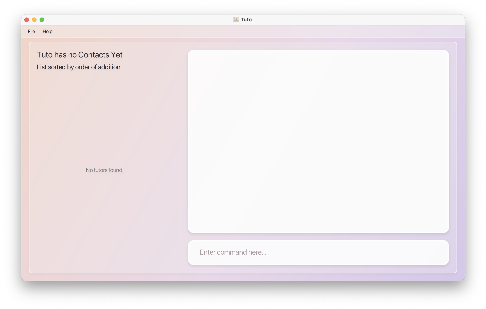

### Step 4 — Try Your First Commands

Type a command into the **Command Box** at the bottom and press **Enter** to run it. Here are a few to try:

| What you want to do       | Command to type                                                     |
| ------------------------- | ------------------------------------------------------------------- |
| View all tutors           | `list`                                                              |
| Add a new tutor           | `add n/Jane Smith p/91234567 e/jane@example.com s/Mathematics r/60` |
| Find tutors by subject    | `find s/Mathematics`                                                |
| Sort tutors by name (A–Z) | `sort name asc`                                                     |
| Delete the 1st tutor      | `delete 1`                                                          |
| Open help                 | `help`                                                              |
| Exit the app              | `exit`                                                              |

<box type="tip" seamless>

**Tip:** The [Command Summary](#command-summary) at the bottom of this guide is a handy reference once you are familiar with the commands.

</box>

---

## Understanding the Interface


Tuto's interface has three main areas:

- **Tutor List Panel (Left)** — shows all Tutor Profiles saved
- **Result Display (Top Right)** — shows feedback after each command (success or error messages, records retrieved searching)
- **Command Box (Bottom Right)** — where you type your commands

Each tutor card in the panel shows the tutor's name, phone number, email, subject, and hourly rate. Tags (if any) appear as labels on the card.

---

## Command Basics

### Notes on Command Format

<box type="info" seamless>

The following conventions apply to all commands in this guide:

- Words in `UPPER_CASE` are **values you supply**.<br>
  e.g. in `add n/NAME`, replace `NAME` with the tutor's actual name: `add n/John Doe`.

- Items in `[square brackets]` are **optional**.<br>
  e.g. `[a/ADDRESS]` means the address field can be left out.

- Items followed by `…` can be **used multiple times**.<br>
  e.g. `[t/TAG]…` allows zero, one, or more tags: `t/home`, `t/experienced t/recommended`.

- **Parameters can be given in any order.**<br>
  e.g. `n/NAME p/PHONE` and `p/PHONE n/NAME` are both valid.

- **Extra parameters are ignored** for commands that take none (such as `help`, `list`, `exit`, and `clear`).<br>
  e.g. `help 123` runs as `help`.

</box>

<box type="warning" seamless>

**Note for PDF users:** If you copy commands from a PDF, line breaks may introduce unexpected spaces. Re-type the command manually if it does not execute as expected.

</box>

---

### Understanding List Indices

Commands such as `edit` and `delete` use **`INDEX`**: the number shown beside each tutor in the **Tutor List Panel** for the **current** list order.

<box type="warning" seamless>

**Displayed indices change after `sort` and `delete`**

- After a **`sort`** command, tutors are reordered, so the same person may appear at a **different** index than before.
- After a **`delete`** command, the list becomes shorter and tutors below the removed row **shift up**, so their indices are **renumbered** (what was “tutor 5” may become “tutor 4”).

**Always search with Find or look at the Tutor List Panel again** before typing the next `edit` or `delete` command. Do not assume indices from an earlier step are still correct.

</box>

---

### Duplicate Tutors are Not Allowed

Tuto considers a Tutor Profile to be a duplicate if it shares the exact same **Phone number** or **Email** as an existing tutor. Both during `add` and `edit` operations, Tuto protects your data by rejecting the command if it detects a clash.

<box type="warning" seamless>

**Duplicate Error:** Neither adding a new tutor nor editing an existing one is permitted if it would resolve in two Tutor Profiles having the same phone number or email address.

</box>

---

## Commands

### Viewing Help : `help`

Displays a summary of available commands and their accepted parameter values.

**Format:** `help`

**Expected output:** A help window opens containing command syntax, constraints, and a link to the User Guide. The result display shows `✨  Opened help window.`


---

### Adding a Tutor : `add`

Adds a new Tutor Profile to Tuto.


**Format:** `add n/NAME p/PHONE_NUMBER e/EMAIL s/SUBJECT1 [s/SUBJECT2]... r/RATE [a/ADDRESS] [t/TAG]…`

---

#### Parameters

| Prefix | Field             | Required | Accepted values                                                     |
| ------ | ----------------- | -------- | ------------------------------------------------------------------- |
| `n/`   | Name              | Yes      | Alphanumeric text + spaces                                          |
| `p/`   | Phone number      | Yes      | Digits only, at least 3 digits                                      |
| `e/`   | Email             | Yes      | Valid email format (e.g. `user@example.com`)                        |
| `s/`   | Subject           | Yes      | Alphanumeric text + spaces (e.g. `Advanced Mathematics`, `Biology`) |
| `r/`   | Hourly rate (SGD) | Yes      | Positive integer value (including zero)                             |
| `a/`   | Address           | No       | Any text                                                            |
| `t/`   | Tag               | No       | Alphanumeric text, no spaces                                        |

<box type="tip" seamless>

**Tip:**

1. Tags are powerful ways to organise Tutor Profiles. You can use multiple tags to provide more detail, e.g. `t/home` and `t/weekend`.
2. A person can have any number of tags (including 0) and multiple subjects.
3. Command parameters can be entered in any order.

</box>

---

#### Constraints

Tuto natively handles duplicates to secure your data. See [Duplicate Tutors are Not Allowed](#duplicate-tutors-are-not-allowed) for more details.


---

#### Examples

**Adding with minimum required fields**

```
add n/ elizabeth chang p/ 82516782 e/ elizabeth@example.com s/ piano r/ 76
```


---

**Adding with optional fields (address and tags)**

```
add n/ gabrielle chee p/ 87429246 e/ gabrielle@example.com s/ computing r/ 85 a/ 8 napier road t/ prodigy
```


---

### Editing a Tutor Profile : `edit`

Updates one or more fields of an existing Tutor Profile.


**Format:** edit INDEX [n/NAME] [p/PHONE] [e/EMAIL] [a/ADDRESS] [s/SUBJECT]… [r/RATE] [t/TAG]…

---

#### Parameters

- `INDEX` refers to the number shown next to the tutor in the current list. It must be a **positive integer** (1, 2, 3 …).
- **Accepted Prefixes:** Accepts the same prefixes (`n/`, `p/`, `e/`, `s/`, `r/`, `a/`, `t/`) as the `add` command.
- After a **`sort`** or **`delete`**, indices may no longer match what you saw earlier — see [Understanding List Indices](#understanding-list-indices).
- At least one field must be provided.
- Existing values are replaced with the new values you provide.

---

#### Constraints

<box type="warning" seamless>

- **Subjects are replaced, not added:** Any new subjects you provide will completely overwrite the tutor's existing subjects. Use multiple `s/` prefixes for multiple subjects (e.g. `edit INDEX s/Math s/English`). A single `s/Math Physics` value is **one** subject whose name contains a space, not two separate subjects.
- **At least one subject:** You cannot clear all subjects with a bare `s/` or leave a profile with no subjects. If a data file is damaged and a tutor has no subjects, use `edit` with at least one valid `s/SUBJECT` to fix the profile.
- **Tags are replaced, not added:** Any new tags you provide will completely overwrite the tutor's existing tags. To clear all tags, use an empty prefix: `t/`. To append a new tag, you must retype the existing ones.
- **Identical edits are accepted:** Editing a tutor with values they already have (e.g. changing their rate to the same rate they currently charge) will be accepted as a valid command without throwing an error.
- **No duplicates:** You cannot edit a profile to have the exact same phone number or email address as another tutor. See [Duplicate Tutors are Not Allowed](#duplicate-tutors-are-not-allowed).

</box>

---

#### Examples

**Editing multiple fields at once**

```
edit 3 e/ qingrong@example.com t/ best
```

Updates the phone number and email of the 3rd tutor in the list.

**Replacing tags**

```
edit 2 t/
```

Renames the 2nd tutor and removes all of their tags.

**Updating subject and rate**

```
edit 1 s/Physics r/30
```

Changes the 1st tutor's subjects to Physics only (replacing any previous subjects) and rate to $30/hr.

```
edit 2 s/Math s/English
```

Sets the 2nd tutor's subjects to Math and English only (replacing any previous subjects).

**Expected output:**


---

#### Invalid Usage

**Duplicate Output:**


**Error Output:**


---

### Deleting a Tutor : `delete`

Permanently removes a Tutor Profile from Tuto.


**Format:** `delete INDEX`

---

#### Parameters

- `INDEX` must be a **positive integer** matching a tutor's position in the currently displayed list.
- After you delete someone, **every tutor below that row moves up** and gets a new index. After a **`sort`**, positions change too. See [Understanding List Indices](#understanding-list-indices).

<box type="warning" seamless>

**Caution:** Deletion is permanent and cannot be undone. Double-check the index before running this command.

</box>

---

#### Examples

**Deleting from the full list**

```
delete 2
```

Deletes the Tutor profile with index 2.

**Deleting from search results**

```
find s/Biology
delete 1
```

Deletes the Tutor Profile with index 1

**Expected output:**


---

### Finding Tutors : `find`

Search for tutors by keyword, name, subject, or hourly rate — or combine them for precise filtering.

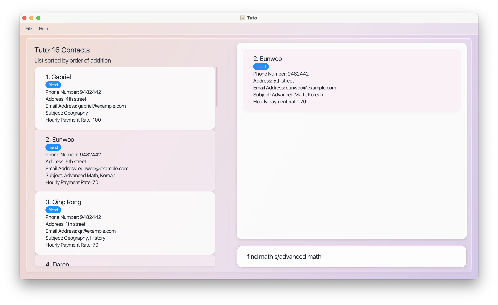

---

#### Prefixes

| Prefix            | Filters by     | Behaviour                                                                                      |
| ----------------- | -------------- | ---------------------------------------------------------------------------------------------- |
| `n/NAME_KEYWORDS` | Name           | Prefix match · Case-insensitive · Space-separate multiple keywords · Only **one `n/`** allowed |
| `s/SUBJECT`       | Subject taught | Prefix match · Case-insensitive · Multiple `s/` allowed (AND logic)                            |
| `r/RATE`          | Hourly rate    | Exact, range, or comparison match · Only **one `r/`** allowed                                  |
| `t/TAG`           | Tag            | Matches tag(s) · Case-insensitive · Multiple `t/` allowed (AND logic)                          |

<box type="tip" seamless>

**Tip:** Spaces after prefixes are optional — `find n/John` and `find n/ John` both work.

</box>

---

#### Search Modes

| Mode                 | Syntax                                                                                 | Returns                                                                |
| -------------------- | -------------------------------------------------------------------------------------- | ---------------------------------------------------------------------- |
| **General Search**   | `find KEYWORD [MORE_KEYWORDS]` (case-insensitive)                                      | Tutors where **any** attribute has a word starting with any keyword    |
| **Filtering**        | `find [PREFIXES]` (case-insensitive)                                                   | Tutors matching **all** prefix conditions                              |
| **General + Filter** | `find KEYWORD [MORE_KEYWORDS] [PREFIXES]` (case-insensitive; keywords before prefixes) | Tutors matching **any** keyword, narrowed by **all** prefix conditions |

---

#### How Matching Works

**Name (`n/`)** — OR logic across keywords

- `n/Ed` matches "Eddy", "Edward", "Eddie" etc.
- `n/Dar Vic` matches tutors named "Dar…" **or** "Vic…" e.g. "Daren", "Victoria"

**Subject (`s/`)** — AND logic across prefixes

- `s/Mat` matches "Math", "Mathematics"
- `s/Math s/Chemistry` returns tutors teaching Math **and** Chemistry

**Rate (`r/`)** — supports four formats

| Format | Example         | Matches                                                 |
| ------ | --------------- | ------------------------------------------------------- |
| Exact  | `r/RATE`        | Tutors charging exactly `RATE`                          |
| Range  | `r/RATE1-RATE2` | Tutors charging between `RATE1` and `RATE2` (inclusive) |
| Above  | `r/>RATE`       | Tutors charging more than `RATE`                        |
| Below  | `r/<RATE`       | Tutors charging less than `RATE`                        |

In every `r/` field above, each numeric token (`RATE`, `RATE1`, `RATE2`) must be **non-negative** (integers only; no negative numbers). For ranges, `RATE1` must also be less than or equal to `RATE2`.

**Mixed prefixes** — all conditions must be met

- `find n/Alex r/40 s/Math` → named "Alex…", rate $40, teaches Math

---

#### Examples

**General Search**

```
find math
```

Returns all tutors containing "math" in any field.

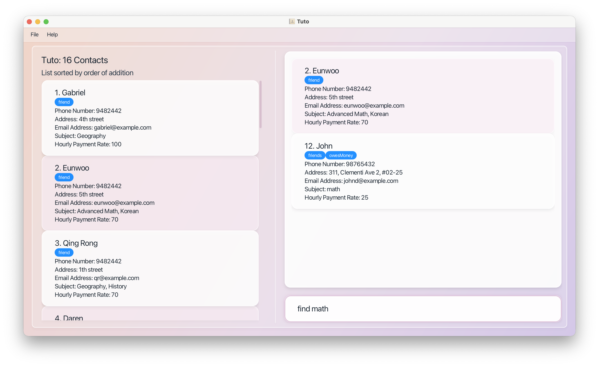

---

**Filtering by name**

```
find n/Eunwoo
find n/Dar Vic
```

Returns tutors named "Eunwoo…"


Returns tutors named "Dar…" **or** "Vic…" respectively.

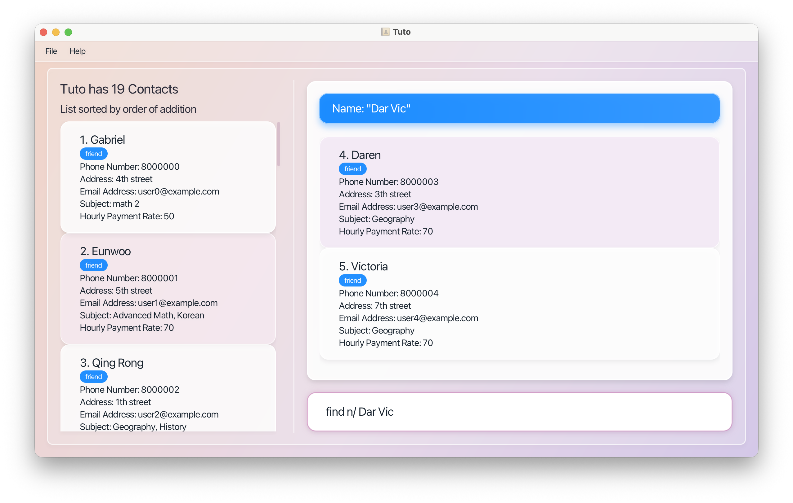

---

**Filtering by subject and rate**

```
find s/Math s/Chemistry
find s/Physics r/>40
find s/History r/40-80
```

Returns tutors teaching Math **and** Chemistry

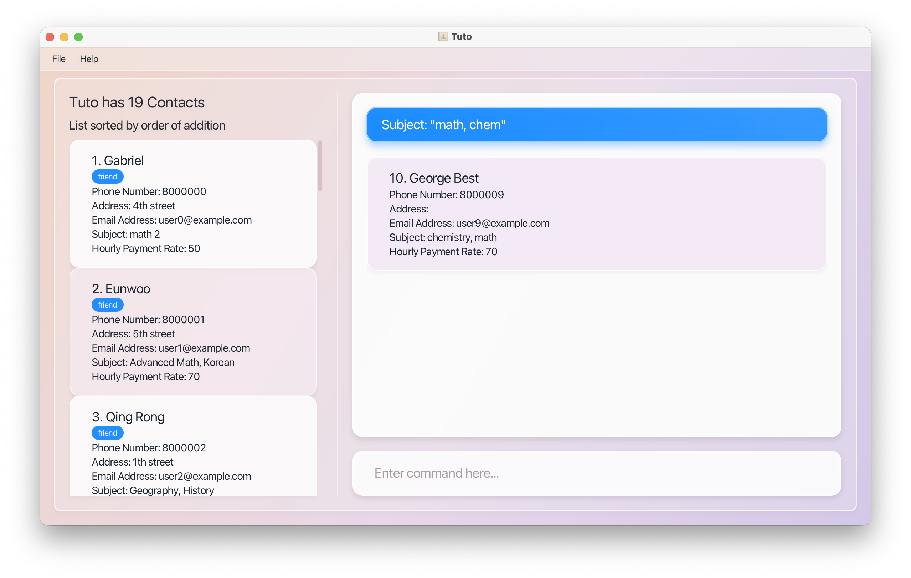

Returns tutors teaching Physics above a rate

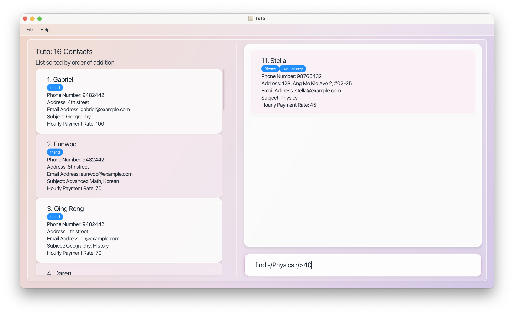

Returns tutors teaching History within a rate range

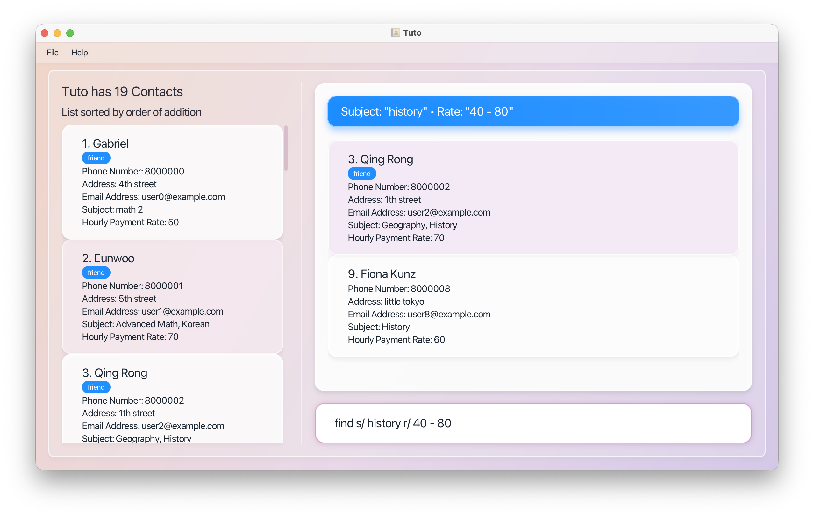

---

**Combined search**

```
find math s/advanced math
find n/Qi r/70 s/History
```

Narrows a general keyword search with prefix filters, or combines multiple prefix conditions.


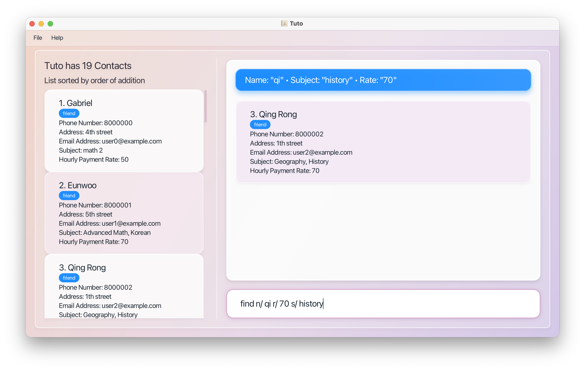

---

Matching tutors appear in the right panel. If no matches are found:

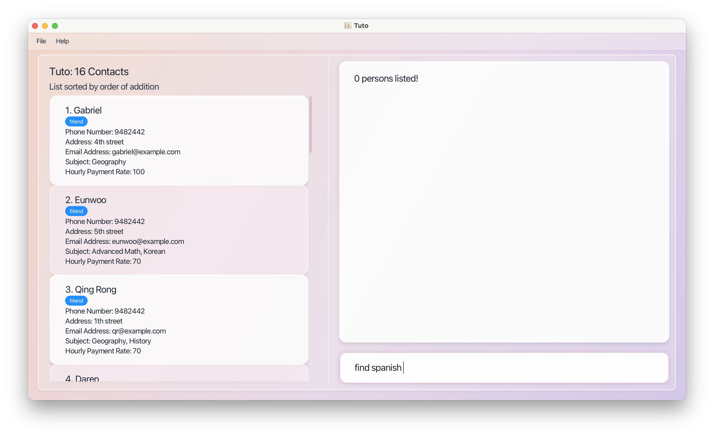

<box type="tip" seamless>

**Tip:** After a `find`, run `list` to return to the full tutor list when running on CLI.

</box>

---

#### Invalid Usage

<box type="warning" seamless>

Only **one** `n/` and one `r/` are allowed per command.

| ❌ Invalid           | Reason                            |
| -------------------- | --------------------------------- |
| `find r/16 r/17`     | Multiple `r/` not allowed         |
| `find n/Alice n/Bob` | Multiple `n/` not allowed         |
| `find`               | Keywords and/or Prefixes required |

</box>

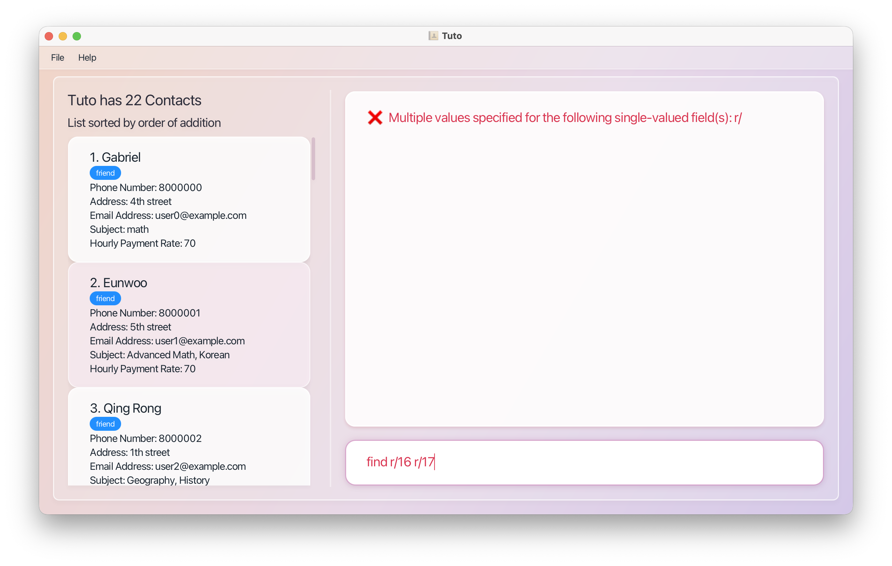

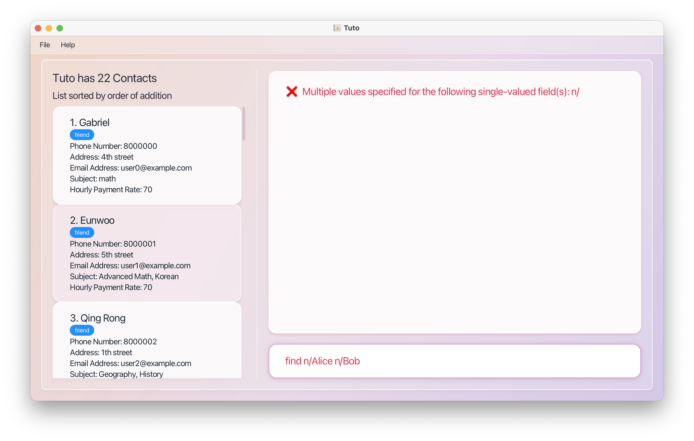


---

### Sorting the Tutor List : `sort`

Changes the **order** of tutors in the Tutor List Panel. Sorting is by **name** or **hourly rate** only; it does not remove or hide tutors.


**Format:** `sort FIELD ORDER`

---

#### Parameters

| Part    | Meaning         | Allowed values                                              |
| ------- | --------------- | ----------------------------------------------------------- |
| `FIELD` | What to sort by | `name` or `rate` (case-insensitive)                         |
| `ORDER` | Sort direction  | `asc` (ascending) or `desc` (descending) (case-insensitive) |

- **Name:** Alphabetical order by full name (case-insensitive).
- **Rate:** Numeric order by hourly rate. If two tutors have the **same rate**, they are ordered by **name** (ascending) as a tie-break.

---

#### Examples

**Sorting by name**

```
sort name asc
```

Shows tutors in alphabetical order from A → Z by name.

**Sorting by rate**

```
sort rate desc
```

Shows highest hourly rate first.

**Expected output:** A confirmation message in the Result Display, and the Tutor List Panel updates to the new order. The header above the list also reflects the active sort.


<box type="warning" seamless>

**Indices update after sorting:** Because `edit` and `delete` use the position number in the **current** list, running `sort` changes which tutor is at each index. See [Understanding List Indices](#understanding-list-indices) before your next command.

</box>

---

#### Invalid Usage

**Error Output:**


---

### Listing All Tutors : `list`

Displays all tutor profiles stored in Tuto. The GUI features a left panel that displays the full contact list at all times, so this command is predominantly used in the CLI or to quickly clear search filters in the main view.


**Format:** `list`

**Expected output:** The central panel automatically updates to show all stored tutors, and the result display shows `✨  Listed all tutors!`.

<box type="tip" seamless>

**Tip:** Run this command to reset the view after a `find` command in CLI.

</box>

---

### Clearing All Entries : `clear`

Permanently clears all tutor entries from Tuto.


**Format:** `clear`

**Expected output:** All tutor profiles are deleted, leaving the Tutor List Panel empty. The result display confirms that the data has been successfully cleared.

<box type="warning" seamless>

**Caution:** This action permanently deletes all data and cannot be undone. Use with extreme care!

</box>

---

### Exiting the Program : `exit`

Closes the Tuto application.

**Format:** `exit`

When `exit` executes successfully, Tuto closes. Tutor data is saved automatically as part of command execution.

---

## Data Management

### Saving Your Data

Tuto's data are saved automatically as a JSON file `[JAR file location]/data/addressbook.json`. Advanced users are welcome to update data directly by editing that data file.

<box type="warning" seamless>

**Caution:**
If your changes to the data file makes its format invalid, Tuto will discard all data and start with an empty data file at the next run. Hence, it is recommended to take a backup of the file before editing it.<br>
Furthermore, certain edits can cause the Tuto to behave in unexpected ways (e.g., if a value entered is outside the acceptable range). Therefore, edit the data file only if you are confident that you can update it correctly.
</box>

---

### Editing the Data File Directly

Advanced users may edit the data file manually using any text editor.

<box type="warning" seamless>

**Caution:** If the file is saved in an invalid format, Tuto will discard all data and start fresh on the next launch. **Back up the file before making any edits.** Additionally, values outside accepted ranges may cause Tuto to behave unexpectedly.

</box>

---

## FAQ

**Q: How do I move my tutor data to a new computer?**

A: Install Tuto on the new computer and run it once to generate the default data folder. Then copy the `addressbook.json` file from your old computer into the `data/` folder on the new one, replacing the empty file.

---

**Q: Tuto opened off-screen after I disconnected an external monitor. What do I do?**

A: Delete the `preferences.json` file in the same folder as `tuto.jar`, then relaunch the app. This resets the window position.

---

**Q: I ran `help` again but the Help Window did not appear. Why?**

A: The Help Window may be minimised. Check your taskbar and restore it manually.

---

## Known Issues

1. **Off-screen window after disconnecting a monitor:** Delete `preferences.json` and relaunch Tuto to reset the window position.
2. **Help Window does not reappear:** If the Help Window is minimised, running `help` again will not open a new one. Restore the minimised window from your taskbar.

---

## Command Summary

| Action     | Format                                                                                                | Example                                                                                                           |
| ---------- | ----------------------------------------------------------------------------------------------------- | ----------------------------------------------------------------------------------------------------------------- |
| **Help**   | `help`                                                                                                | `help`                                                                                                            |
| **Add**    | `add n/NAME p/PHONE_NUMBER e/EMAIL s/SUBJECT1 s/SUBJECT2 ... s/SUBJECTn r/RATE [a/ADDRESS] [t/TAG]…​` | `add n/James Ho p/22224444 e/jamesho@example.com a/123, Clementi Rd, 1234665 s/Biology r/45 t/friend t/colleague` |
| **Edit**   | `edit INDEX [n/NAME] [p/PHONE] [e/EMAIL] [a/ADDRESS] [s/SUBJECT]… [r/RATE] [t/TAG]…`                  | `edit 2 n/James Lee e/james@example.com`                                                                          |
| **Delete** | `delete INDEX`                                                                                        | `delete 3`                                                                                                        |
| **Find**   | `find KEYWORD` \| `find [PREFIXES]` \| `find KEYWORD [PREFIXES]`                                      | `find geography`, `find s/Biology r/45`, `find korean r/>50`                                                      |
| **Sort**   | `sort FIELD ORDER`                                                                                    | `sort name asc`, `sort rate desc`                                                                                 |
| **List**   | `list`                                                                                                | `list`                                                                                                            |
| **Clear**  | `clear`                                                                                               | `clear`                                                                                                           |
| **Exit**   | `exit`                                                                                                | `exit`                                                                                                            |
