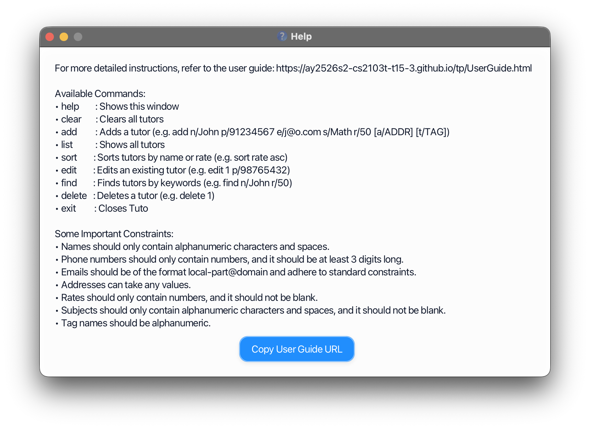
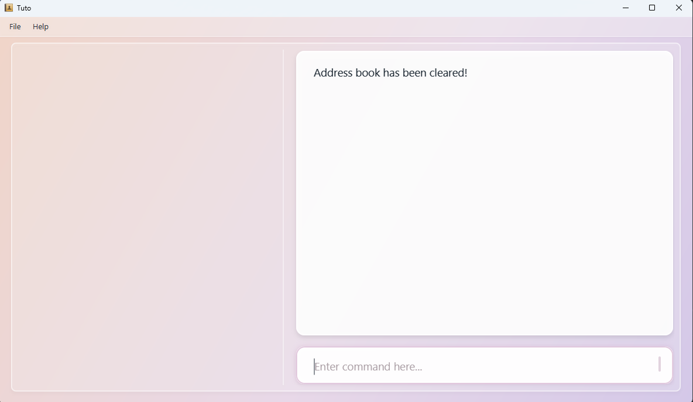
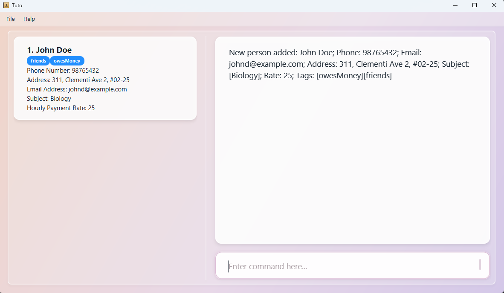
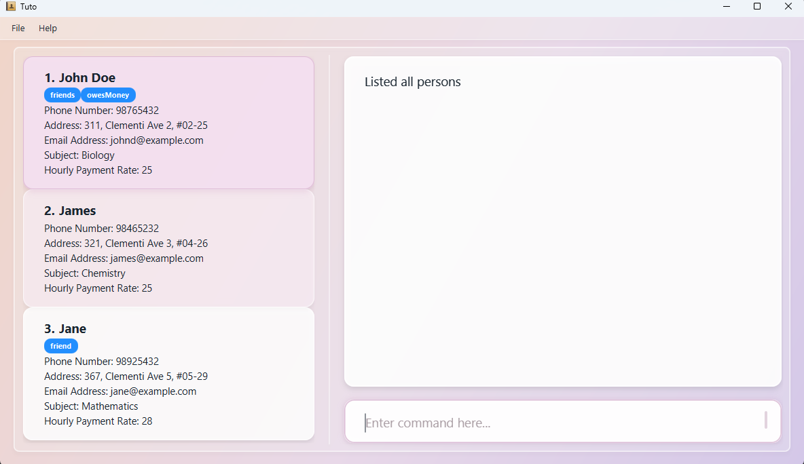
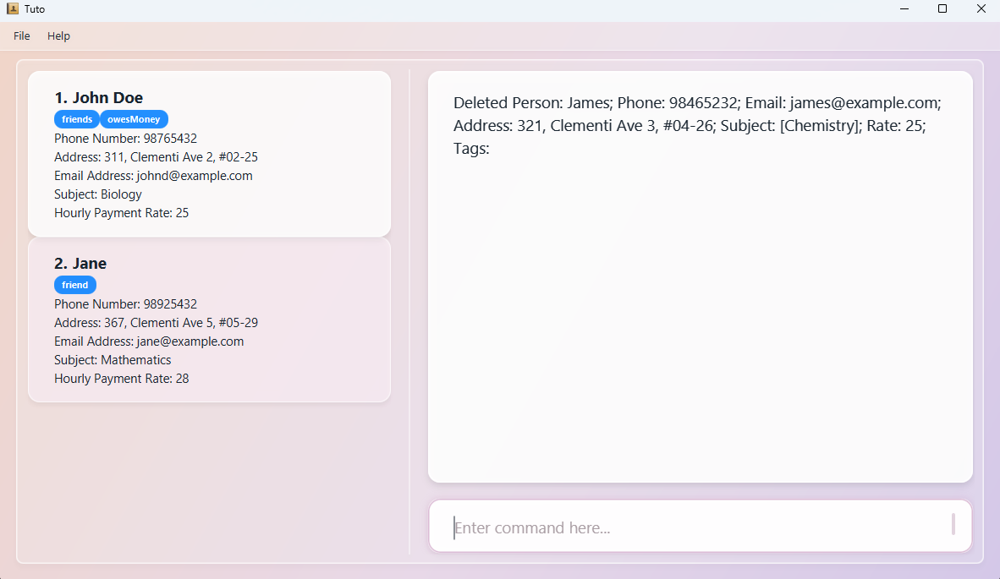

# Tuto User Guide

**Tuto** is a desktop app that helps **parents manage a list of freelance tutors** for their children. It is optimised for users who prefer typing commands over clicking through menus, while still providing a clean visual interface to view tutor information at a glance.

<box type="info" seamless>

**Who is this guide for?**
This guide is written for parents who are comfortable using a keyboard and want to manage tutor contacts efficiently. No prior technical experience is required — if you can open a terminal and type commands, you are ready to use Tuto.

</box>

---
## Table of Contents

- [Tuto User Guide](#tuto-user-guide)
  - [Table of Contents](#table-of-contents)
  - [Quick Start](#quick-start)
    - [Step 1 — Install Java](#step-1--install-java)
    - [Step 2 — Download Tuto](#step-2--download-tuto)
    - [Step 3 — Launch Tuto](#step-3--launch-tuto)
    - [Step 4 — Try Your First Commands](#step-4--try-your-first-commands)
  - [Understanding the Interface](#understanding-the-interface)
  - [Features](#features)
    - [Notes on Command Format](#notes-on-command-format)
    - [Viewing Help : `help`](#viewing-help--help)
    - [Clearing all entries: `clear`](#clearing-all-entries-clear)
    - [Adding a Tutor : `add`](#adding-a-tutor--add)
    - [Listing All Tutors : `list`](#listing-all-tutors--list)
    - [Sorting the Tutor List : `sort`](#sorting-the-tutor-list--sort)
    - [Editing a Tutor Profile : `edit`](#editing-a-tutor-profile--edit)
    - [Finding Tutors : `find`](#finding-tutors--find)
    - [Deleting a Tutor : `delete`](#deleting-a-tutor--delete)
    - [Exiting the program : `exit`](#exiting-the-program--exit)
    - [Saving Your Data](#saving-your-data)
  - [](#)
    - [Editing the Data File Directly](#editing-the-data-file-directly)
  - [FAQ](#faq)
  - [Known Issues](#known-issues)
  - [Command Summary](#command-summary)
---

## Quick Start

Follow these steps to get Tuto running on your computer in under 5 minutes.

### Step 1 — Install Java

Tuto requires **Java 17 or above**.

* **Windows / Linux:** Download Java 17 from [Adoptium](https://adoptium.net/).
* **Mac:** Follow the exact installation steps [here](https://se-education.org/guides/tutorials/javaInstallationMac.html), as the standard Mac JDK may not be compatible.

To verify your Java version, open a terminal and run:

```
java -version
```

You should see `17` or higher in the output.

### Step 2 — Download Tuto

Download the latest `tuto.jar` file from the [Tuto releases page](https://github.com/AY2526S2-CS2103T-T15-3/tp/releases).

Move the file into a dedicated folder (e.g. `~/tuto/`). This folder will store your data going forward.

### Step 3 — Launch Tuto

1. Open a terminal (Command Prompt on Windows, Terminal on Mac/Linux).
2. Navigate to the folder containing `tuto.jar`:
   ```
   cd ~/tuto
   ```
3. Run the application:
   ```
   java -jar tuto.jar
   ```

A window similar to the one below should appear within a few seconds, pre-loaded with sample tutor data.


### Step 4 — Try Your First Commands

Type a command into the **Command Box** at the top and press **Enter** to run it. Here are a few to try:

| What you want to do | Command to type |
|---|---|
| View all tutors | `list` |
| Add a new tutor | `add n/Jane Smith p/91234567 e/jane@example.com s/Mathematics r/60` |
| Find tutors by subject | `find s/Mathematics` |
| Sort tutors by name (A–Z) | `sort name asc` |
| Delete the 1st tutor | `delete 1` |
| Open help | `help` |
| Exit the app | `exit` |

<box type="tip" seamless>

**Tip:** The [Command Summary](#command-summary) at the bottom of this guide is a handy reference once you are familiar with the commands.

</box>

---

## Understanding the Interface

Tuto's interface has three main areas:

* **Command Box** — where you type your commands
* **Result Display** — shows feedback after each command (success messages or error details)
* **Tutor List Panel** — displays all tutor profiles matching the current view

Each tutor card in the panel shows the tutor's name, phone number, email, subject, and hourly rate. Tags (if any) appear as labels on the card.

---

## Features

### Notes on Command Format

<box type="info" seamless>

The following conventions apply to all commands in this guide:

* Words in `UPPER_CASE` are **values you supply**.<br>
  e.g. in `add n/NAME`, replace `NAME` with the tutor's actual name: `add n/John Doe`.

* Items in `[square brackets]` are **optional**.<br>
  e.g. `[a/ADDRESS]` means the address field can be left out.

* Items followed by `…` can be **used multiple times**.<br>
  e.g. `[t/TAG]…` allows zero, one, or more tags: `t/home`, `t/experienced t/recommended`.

* **Parameters can be given in any order.**<br>
  e.g. `n/NAME p/PHONE` and `p/PHONE n/NAME` are both valid.

* **Extra parameters are ignored** for commands that take none (such as `help`, `list`, `exit`, and `clear`).<br>
  e.g. `help 123` runs as `help`.

</box>

<box type="warning" seamless>

**Note for PDF users:** If you copy commands from a PDF, line breaks may introduce unexpected spaces. Re-type the command manually if it does not execute as expected.

</box>

<box type="warning" seamless>

**Displayed indices change after `sort` and `delete`**

Commands such as `edit` and `delete` use **`INDEX`**: the number shown beside each tutor in the **Tutor List Panel** for the **current** list order.

* After a **`sort`** command, tutors are reordered, so the same person may appear at a **different** index than before.
* After a **`delete`** command, the list becomes shorter and tutors below the removed row **shift up**, so their indices are **renumbered** (what was “tutor 5” may become “tutor 4”).

**Always look at the Tutor List Panel again** before typing the next `edit` or `delete` command. Do not assume indices from an earlier step are still correct.

</box>

---

### Viewing Help : `help`

Opens a link to this User Guide.

**Format:** `help`

**Expected output:** A pop-up window appears with a link to the online User Guide.



---

### Clearing all entries: `clear`

Clears all entries from the address book.



Format: `clear`

---
### Adding a Tutor : `add`

Adds a new tutor profile to Tuto.



Format: `add n/NAME p/PHONE_NUMBER e/EMAIL s/SUBJECT1 s/SUBJECT2 ... s/SUBJECTn r/RATE [a/ADDRESS] [t/TAG]…​`

| Flag | Field | Required? | Accepted values |
|---|---|---|---|
| `n/` | Name | Yes | Any non-empty text |
| `p/` | Phone number | Yes | Digits only, at least 3 digits |
| `e/` | Email | Yes | Valid email format (e.g. `user@example.com`) |
| `a/` | Address | No | Any text |
| `s/` | Subject | Yes | Any non-empty text (e.g. `Mathematics`, `Biology`) |
| `r/` | Hourly rate (SGD) | Yes | Positive number |
| `t/` | Tag | No | Alphanumeric, no spaces |

<box type="tip" seamless>

**Tip:** 
  1. Tags are powerful ways to organise contacts. You can use multiple tags in a tutor contact to provide more information, e.g. `t/home` for home tutoring 
services. 
  2. A person can have any number of tags (including 0) and more than one subjects.
  3. The parameters of the command can be entered in any orders.

</box>

<box type="warning" seamless>

**Note:** Adding a tutor with the same name, phone number, or email as an existing entry is not allowed. Tuto treats each field as unique and will reject the operation if any duplicate is detected. If two tutors happen to share a name, consider using a middle initial to differentiate them.

</box>

**Examples:**

```
add n/John Doe p/98765432 e/johnd@example.com s/Chemistry r/50
```
Adds John Doe as a Chemistry tutor charging $50/hr, with no address or tags.

```
add n/Betsy Crowe p/1234567 e/betsycrowe@example.com a/Newgate Prison s/Biology r/55 t/experienced t/recommended
```
Adds Betsy Crowe as a Biology tutor with an address and two tags.

**Expected output:**
```
New person added: John Doe; Phone: 98765432; Email: johnd@example.com; Address: ; Subject: Chemistry; Rate: 50; Tags:
```

---

### Listing All Tutors : `list`

Displays all tutor profiles stored in Tuto.



**Format:** `list`

**Expected output:** The Tutor List Panel refreshes to show all contacts. The Result Display shows the total number of tutors listed.

<box type="tip" seamless>

**Tip:** Use `list` to reset the view after a `find` command has filtered your results.

</box>

---

### Sorting the Tutor List : `sort`

Changes the **order** of tutors in the Tutor List Panel. Sorting is by **name** or **hourly rate** only; it does not remove or hide tutors.

**Format:**
```
sort FIELD ORDER
```

| Part | Meaning | Allowed values |
|---|---|---|
| `FIELD` | What to sort by | `name` or `rate` (case-insensitive) |
| `ORDER` | Sort direction | `asc` (ascending) or `desc` (descending) (case-insensitive) |

* **Name:** Alphabetical order by full name (case-insensitive).
* **Rate:** Numeric order by hourly rate. If two tutors have the **same rate**, they are ordered by **name** (ascending) as a tie-break.

**Examples:**

```
sort name asc
```
Shows tutors from A → Z by name.

```
sort rate desc
```
Shows highest hourly rate first.

**Expected output:** A confirmation message in the Result Display, and the Tutor List Panel updates to the new order. The header above the list also reflects the active sort.

<box type="warning" seamless>

**Indices update after sorting:** Because `edit` and `delete` use the position number in the **current** list, running `sort` changes which tutor is at each index. See [Displayed indices change after `sort` and `delete`](#notes-on-command-format) before your next command.

</box>

---

### Editing a Tutor Profile : `edit`

Updates one or more fields of an existing tutor profile.

**Format:**
```
edit INDEX [n/NAME] [p/PHONE] [e/EMAIL] [a/ADDRESS] [s/SUBJECT] [r/RATE] [t/TAG]…
```

* `INDEX` refers to the number shown next to the tutor in the current list. It must be a **positive integer** (1, 2, 3 …).
* After a **`sort`** or **`delete`**, indices may no longer match what you saw earlier — see [Displayed indices change after `sort` and `delete`](#notes-on-command-format).
* At least one field must be provided.
* Existing values are replaced with the new values you provide.

<box type="warning" seamless>

**Note:** Editing tags **replaces all existing tags** — it does not add to them. To remove all tags, use `t/` with nothing after it. To keep existing tags while adding a new one, you must retype all the tags you want to keep.

</box>

<box type="warning" seamless>

**Note:** Editing a tutor with the same name, phone number, or email as an existing entry is not allowed. Tuto treats each field as unique and will reject the operation if any duplicate is detected. If two tutors happen to share a name, consider using a middle initial to differentiate them.

</box>

**Examples:**

```
edit 1 p/91234567 e/johndoe@example.com
```
Updates the phone number and email of the 1st tutor in the list.

```
edit 2 n/Betsy Crower t/
```
Renames the 2nd tutor and removes all of their tags.

```
edit 1 s/Physics r/30
```
Changes the 1st tutor's subject to Physics and rate to $30/hr.

**Expected output:**
```
Edited Person: John Doe; Phone: 91234567; Email: johndoe@example.com; Address: ; Subject: Chemistry; Rate: 50; Tags:
```

---
### Finding Tutors : `find`

Searches for tutors by name, subject, or hourly rate. Can combine prefixes (`n/`, `s/`, `r/`) in one command.

| Prefix | Description | Behaviour                                                                                                               | Example                                          |
|--------|------------|-------------------------------------------------------------------------------------------------------------------------|--------------------------------------------------|
| `n/NAME_KEYWORD [MORE_NAME_KEYWORDS]` (Name) | Search by tutor name | - Multiple keywords allowed (space-separated)<br>- Case-insensitive<br>- Prefix matching<br>- Only **one `n/` allowed** | `find n/Hans` |
| `s/SUBJECT` (Subject) | Search by subject taught | - Multiple `s/` prefixes allowed<br>- Case-insensitive<br>- Prefix matching<br>                                         | `find s/math s/science`                          |
| `r/RATE` (Rate) | Search by hourly rate | - Matches **exact rate**<br>- Only **one `r/` allowed**                                                                 | `find r/50`                                      |

- Name and subject searches support **prefix-based matching**
  - e.g. `find n/Han` matches "Hans"
  - e.g. `find s/Mat` matches "Math", "Mathematics"
- Multiple name keywords return tutors matching any of the keywords (OR logic). 
  - e.g. `find n/Han Bo` returns all tutors with names starting with "Han" or "Bo" (e.g. "Hans", "Bo").
- Multiple subject prefixes return tutors matching any of the keywords (OR logic).
  - e.g. `find s/Math s/Chemistry` returns all tutors with subject Math or Chemistry.
- Spaces after prefixes are optional (`find n/John` and `find n/ John` both work)
- When different prefixes are used together, tutors must match **all conditions**  
  (e.g. `find n/Alex r/40 s/Math` returns tutors named Alex, charging 40, and teaching Math)
- **Invalid usage**
  - Multiple `r/` → ❌ `find r/16 r/17`
  - Multiple `n/` → ❌ `find n/Alice n/Bob`

<box type="tip" seamless>

**Tip:** After a `find`, use `list` to return to the full tutor list.

</box>

---
**Examples:**

`find n/John`  
Returns all tutors with "John" in their name.

`find s/Math`  
Returns tutors who teach Math.

`find s/Math s/Chemistry`  
Returns tutors who teach Math **OR** Chemistry.

`find r/50`  
Returns tutors charging exactly $50/hr.

`find n/Alex r/40 s/Physics`  
Returns tutors named Alex, charging $40, **AND** teaching Physics.


**Expected output:**
If there are matching tutors, it will show only matching tutors on the right panel. 

Else, will display:
```
0 persons listed!
```


---

### Deleting a Tutor : `delete`

Permanently removes a tutor profile from Tuto.



Format: `delete INDEX`

* `INDEX` must be a **positive integer** matching a tutor's position in the currently displayed list.
* After you delete someone, **every tutor below that row moves up** and gets a new index. After a **`sort`**, positions change too. See [Displayed indices change after `sort` and `delete`](#notes-on-command-format).

<box type="warning" seamless>

### Exiting the program : `exit`
**Caution:** Deletion is permanent and cannot be undone. Double-check the index before running this command.

</box>

**Examples:**

```
list
delete 2
```
Deletes the 2nd tutor in the full list.

```
find s/Biology
delete 1
```
Deletes the 1st tutor returned in the Biology search results.

**Expected output:**
```
Deleted Person: Betsy Crowe; Phone: 1234567; Email: betsycrowe@example.com; Address: Newgate Prison; Subject: Biology; Rate: 55; Tags: [experienced][recommended]
```

---
### Saving Your Data

Tuto's data are saved automatically as a JSON file `[JAR file location]/data/Tuto.json`. Advanced users are welcome to update data directly by editing that data file.

<box type="warning" seamless>

**Caution:**
If your changes to the data file makes its format invalid, Tuto will discard all data and start with an empty data file at the next run.  Hence, it is recommended to take a backup of the file before editing it.<br>
Furthermore, certain edits can cause the Tuto to behave in unexpected ways (e.g., if a value entered is outside the acceptable range). Therefore, edit the data file only if you are confident that you can update it correctly.
</box>
--------------------------------------------------------------------------------------------------------------------

### Editing the Data File Directly

Advanced users may edit the data file manually using any text editor.

<box type="warning" seamless>

**Caution:** If the file is saved in an invalid format, Tuto will discard all data and start fresh on the next launch. **Back up the file before making any edits.** Additionally, values outside accepted ranges may cause Tuto to behave unexpectedly.

</box>

---

## FAQ

**Q: How do I move my tutor data to a new computer?**

A: Install Tuto on the new computer and run it once to generate the default data folder. Then copy the `addressbook.json` file from your old computer into the `data/` folder on the new one, replacing the empty file.

---

**Q: Tuto opened off-screen after I disconnected an external monitor. What do I do?**

A: Delete the `preferences.json` file in the same folder as `tuto.jar`, then relaunch the app. This resets the window position.

---

**Q: I ran `help` again but the Help Window did not appear. Why?**

A: The Help Window may be minimised. Check your taskbar and restore it manually.

---

## Known Issues

1. **Off-screen window after disconnecting a monitor:** Delete `preferences.json` and relaunch Tuto to reset the window position.
2. **Help Window does not reappear:** If the Help Window is minimised, running `help` again will not open a new one. Restore the minimised window from your taskbar.

---

## Command Summary

| Action | Format | Example |
|---|---|---|
| **Help** | `help` | `help` |
| **Add** | `add n/NAME p/PHONE_NUMBER e/EMAIL s/SUBJECT1 s/SUBJECT2 ... s/SUBJECTn r/RATE [a/ADDRESS] [t/TAG]…​` | `add n/James Ho p/22224444 e/jamesho@example.com a/123, Clementi Rd, 1234665 s/Biology r/45 t/friend t/colleague` |
| **List** | `list` | `list` |
| **Sort** | `sort FIELD ORDER` | `sort name asc`, `sort rate desc` |
| **Edit** | `edit INDEX [n/NAME] [p/PHONE] [e/EMAIL] [a/ADDRESS] [s/SUBJECT] [r/RATE] [t/TAG]…` | `edit 2 n/James Lee e/james@example.com` |
| **Find** | `find n/KEYWORD [MORE_KEYWORDS]` \| `find s/SUBJECT` \| `find r/RATE` | `find n/James`, `find s/Biology`, `find r/45` |
| **Delete** | `delete INDEX` | `delete 3` |
| **Clear** | `clear` | `clear` |
| **Exit** | `exit` | `exit` |
