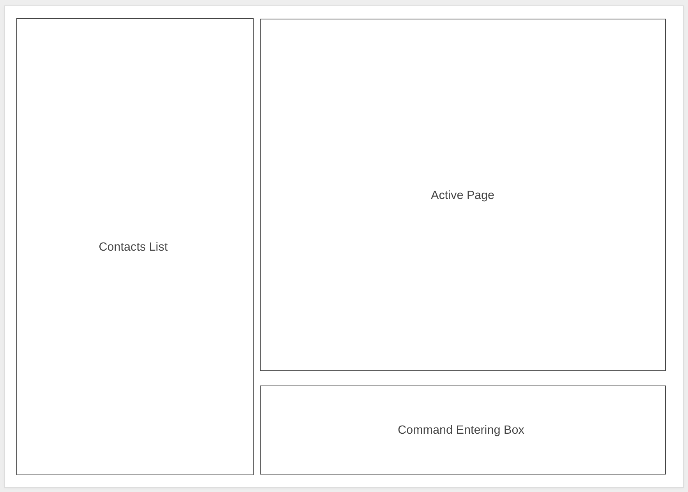

# Tuto

**Tuto is a desktop application for managing your contact details.** While it has a GUI, most of the user interactions happen using a CLI (Command Line Interface).

**Tuto** is **optimised for use via a Command Line Interface (CLI)** while still offering the benefits of a Graphical User Interface (GUI). If you can type fast, Tuto lets you manage tutor contacts faster than traditional GUI apps.

**Acknowledgements**

* Libraries used: [JavaFX](https://openjfx.io/), [Jackson](https://github.com/FasterXML/jackson), [JUnit5](https://github.com/junit-team/junit5)
